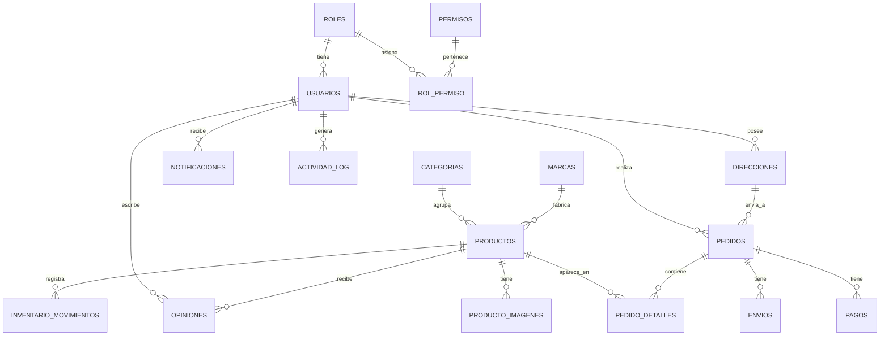

# Diagrama Entidad-Relación

```mermaid
erDiagram
    ROLES ||--o{ USUARIOS : tiene
    ROLES ||--o{ ROL_PERMISO : asigna
    PERMISOS ||--o{ ROL_PERMISO : pertenece
    USUARIOS ||--o{ DIRECCIONES : posee
    USUARIOS ||--o{ PEDIDOS : realiza
    USUARIOS ||--o{ OPINIONES : escribe
    USUARIOS ||--o{ NOTIFICACIONES : recibe
    USUARIOS ||--o{ ACTIVIDAD_LOG : genera
    CATEGORIAS ||--o{ PRODUCTOS : agrupa
    MARCAS ||--o{ PRODUCTOS : fabrica
    PRODUCTOS ||--o{ PRODUCTO_IMAGENES : tiene
    PRODUCTOS ||--o{ OPINIONES : recibe
    PRODUCTOS ||--o{ PEDIDO_DETALLES : aparece_en
    PRODUCTOS ||--o{ INVENTARIO_MOVIMIENTOS : registra
    PEDIDOS ||--o{ PEDIDO_DETALLES : contiene
    PEDIDOS ||--o{ PAGOS : tiene
    PEDIDOS ||--o{ ENVIOS : tiene
    DIRECCIONES ||--o{ PEDIDOS : envia_a
```

Importa `database/schema.sql` en MySQL Workbench → menú **Database → Reverse Engineer**
para visualizarlo gráficamente.
